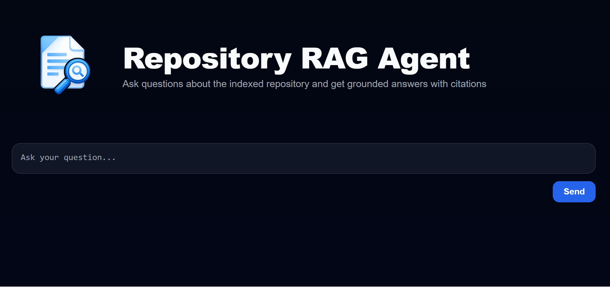
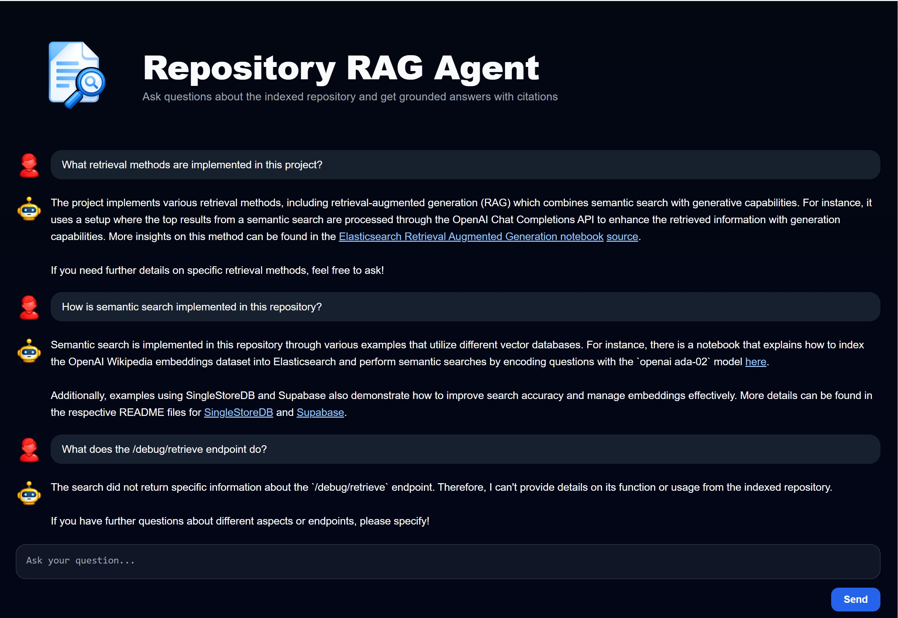
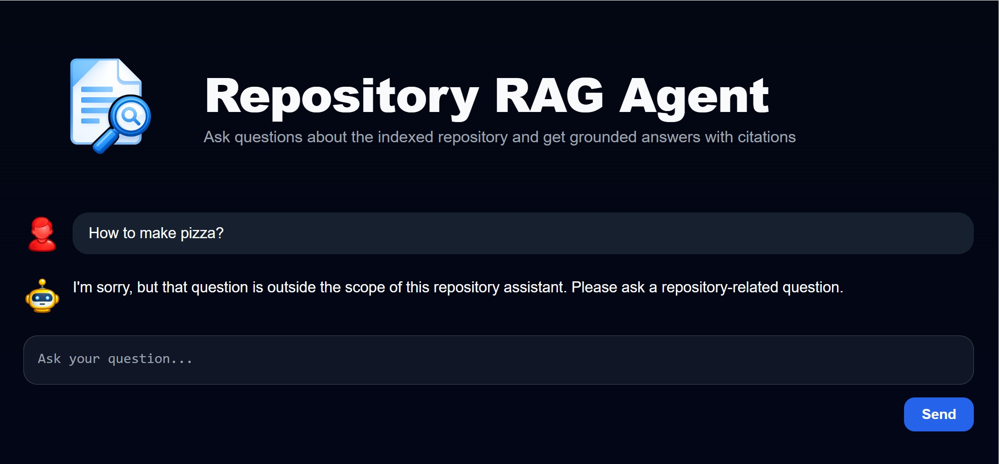

# Repository RAG Agent

FastAPI-based repository question-answering system with BM25, vector, and hybrid retrieval, judge-based evaluation, and a lightweight web UI.

## Overview

This project answers questions about an indexed GitHub repository using the repository’s own content instead of producing unsupported generic responses. It retrieves relevant chunks, prepares grounded context, and returns citation-backed answers through a FastAPI backend and browser UI.

## Tech Stack

- Python
- FastAPI
- Pydantic AI
- BM25 retrieval
- Sentence Transformers (`all-MiniLM-L6-v2`)
- Hybrid retrieval with Reciprocal Rank Fusion (RRF)
- Jinja2 templates
- HTML, CSS, JavaScript
- NumPy
- Pytest
- Uvicorn

## Key Features

- Repository-grounded question answering
- Multiple retrieval modes: BM25, vector, hybrid
- Query formulation for stronger lexical search
- Retrieval-only debug endpoint
- Judge-based evaluation for saved logs
- Evaluation-question generation from repository documents
- Lightweight browser interface served by FastAPI
- Modular Python structure for reuse and extension

## How It Works

Question -> retrieval service -> relevant repository chunks -> grounded context -> agent answer with citations

Runtime flow:
- Frontend UI is served at `/`
- The chat interface sends requests to `POST /ask`
- Retrieval selects supporting chunks from the indexed repository
- The agent returns a grounded answer with source references
- `POST /debug/retrieve` can be used to inspect retrieval behavior without running full answer generation

## Retrieval and Agent Design

The retrieval layer supports BM25, vector search, and hybrid ranking. BM25 is currently the default runtime strategy, and query formulation is applied before lexical search.

The agent logic lives in `src/agent/` and is intentionally small:
- `prompts.py` defines repository-scoped answering behavior
- `tools.py` exposes retrieval results to the agent in citation-friendly form
- `builder.py` initializes the runtime agent

## Evaluation

This project includes both retrieval evaluation and judge-based answer evaluation.

Retrieval snapshot:
- `bm25_raw: hit_rate=0.60, mrr=0.350`
- `bm25_formulated: hit_rate=0.80, mrr=0.700`
- `vector: hit_rate=0.80, mrr=0.567`
- `hybrid: hit_rate=0.80, mrr=0.667`

Current runtime default:
- BM25 with query formulation

Evaluation utilities are organized under `src/evaluation/` and support:
- retrieval metrics
- evaluation-question generation
- judge-based review of saved interaction logs
- flattened summaries for later analysis

## Quick Start

From the project root:

    uv run uvicorn app.main:app --reload

Open:
- `http://127.0.0.1:8000/`
- `http://127.0.0.1:8000/health`
- `http://127.0.0.1:8000/docs`

Useful commands:

    uv run python -m scripts.smoke_test
    uv run python -m scripts.generate_eval_data
    uv run python -m scripts.run_eval
    uv run python -m scripts.run_judge_eval

## Configuration

If you clone this repository, API key loading behavior is controlled in:
- `src/config.py`
- `src/agent/builder.py`

Current external key path:
- `C:\projects\OPEN_AI.txt`

If you want to change where the app reads the key from, update the resolution logic in `src/config.py`. If you want to change how the agent is initialized with that resolved key, update `src/agent/builder.py`.

## Usage

Main routes:
- `GET /` -> browser UI
- `POST /ask` -> full retrieval-backed answer generation
- `POST /debug/retrieve` -> retrieval-only debugging
- `GET /health` -> readiness check

Example questions:
- How do embeddings work in this repo?
- How is semantic search implemented?
- Where is retrieval evaluation defined?
## Screenshots

### Homepage


### Repository-grounded answer


### Out-of-scope question handling


## Project Structure

<details>
<summary>View project structure</summary>

```text
course/
  app/
    main.py
    routes/
    schemas/
    services/
    static/
    templates/

  src/
    agent/
    retrieval/
    evaluation/
    artifacts.py
    config.py
    exceptions.py

  data/
    artifacts/
    processed/
    eval/

  scripts/
    smoke_test.py
    generate_eval_data.py
    run_eval.py
    run_judge_eval.py

  tests/
  README.md
  pyproject.toml
  uv.lock

